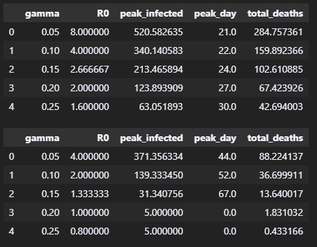

# Epidemiological Model Assignment — Parameter Exploration

**Course**: KEN3170 — Multi-scale modeling of biological systems
**Group number**: 6

---

## 1. Repository overview
- `analysis.ipynb` — main notebook containing all required sections (Setup, Part 1–3, Conclusions)
- `requirements.txt` — Python dependencies (jinja2, numpy, matplotlib, pandas, sklearn-python, seaborn)
- `README.md` — this file

**How to run**: 
- `pip install -r requirements.txt` 
- then open and run `analysis.ipynb` top to b ottom (give run all)

---

## 2. Part 1 — Parameter analysis function
**Function**: `analyze_recovery_rates(beta, mu, N, I0, simulation_days)`
- Brief description of your approach: 
We compare five recovery rates while holding transmission, mortality, population size, and initial infections constant. For each value, the table records the reproduction number, the maximum number infectious at one time, when that maximum occurs, and cumulative deaths at the end of the simulation.
- Output DataFrame (γ = 0.05–0.25), matching your notebook exactly

---

## 3. Part 2 — Scenario comparison
- Result tables for Scenario A (High Transmission) and Scenario B (Low Transmission)

- Which scenario is worse for public health, and why

We compare two 200-day scenarios using the same five recovery rates. Scenario A represents high transmission and mortality; Scenario B represents lower transmission and mortality. The tables and figure below use identical metrics and formatting so the public-health trade-off is easy to inspect.

**Scenario A — High transmission:** $\beta=0.4$, $\mu=0.02$, $N=1000$, $I_0=5$

**Scenario B — Low transmission:** $\beta=0.2$, $\mu=0.005$, $N=1000$, $I_0=5$

There are numerous reasons for scenario A being worse than scenario B, the first being that scenario A has double the transmission rate, because of this this scenario will peak earlier, while also having a higher peak infection wise, this could overload healthcare systems because over 520 people get sick at once which is half the town. Scenario B peaks later at day 44 with 371 (this 520 vs 371 is based on a recovery rate of 0.05). Another reason that scenario A is worse is because scenario A has 4 times higher mortality rate, so this then combines with higher cases to have much more deaths as well, (285 vs 88.2). In Scenario A, R₀ is above 1 at every recovery rate tested. In Scenario B, R₀ equals 1 at γ = 0.20 and falls below 1 at γ = 0.25.

---

## 4. Part 3 — Policy recommendations
- 4.1 Parameter impact analysis

Increasing the recovery rate reduces peak infections and total deaths:

- **Peak infections fall sharply.** In Scenario A, the peak drops from about 521 people at γ = 0.05 to about 63 at γ = 0.25, an 88% reduction. In Scenario B, the peak falls from about 371 to 5 people over the same range.
- **Total deaths fall sharply.** In Scenario A, deaths fall from about 285 at γ = 0.05 to about 43 at γ = 0.25, an 85% reduction.
- **Epidemic duration also changes.** Defining duration as the time from the start until infections fall below 1 person after the peak, Scenario A lasts about 118 days at γ = 0.05 and 84 days at γ = 0.25. However, duration does not decrease at every step: it reaches 77 days at γ = 0.15 before increasing again.

Faster recovery means people spend less time infectious, reducing opportunities to infect others. A lower peak could also reduce pressure on healthcare services because fewer people may need care at the same time.

- 4.2 Intervention analysis

For this one let's look at the baseline of gamma = 0.1, in this case there are 159.9 deaths. If we change gamma to 0.15, which is a 50 percent boost, the deaths drop to 102.6. So 159.9 - 102.6 = 57.3 deaths less, and (57.3 / 159.9) * 100% = 35.8 percent reduction in total deaths. In this case quicker recovery prevents about 35.8% of baseline deaths in this simulation, without having to change beta through lockdowns or masks for example.

- 4.3 Real-world application

So to increase recovery rate we must look at things which have an impact after a person is already infected, so this wouldn't include vaccines. Some things for this are antivirals, looking online for covid it would for example be a drug called paxlovid that could help. So vaccines would impact beta, and antivirals would impact gamma. An example is Tamiflu (oseltamivir) for the flu. Its mechanism is blocking the neuraminidase enzyme so the virus can't release from infected cells. According to CDC guidance, early treatment shortens illness duration by about one day, though symptom reduction doesn't mean gamma increases by that exact same percentage. So for example if a sample illness lasts 7 days so gamma 1/7, if we can reduce that to 6 days with antivirals, it would be 1/6 so a 16.66
percent increase in recovery rate.

---

## 5. Conclusions

Our main takeaways from this assignment: 

- Gamma values have such a crucial role in modelling of model systems. The higher the recovery rate the lower the sick population(I), shorter transmission time therefore reducing exposure and  also lower the number of deaths(D). The effects are seen drastically as calculated above. eg: by increasing gamma by 50%, about 35.8% more of the population can survive.

- As mentioned earlier, whatever can be done in a real world situation to bring down the transmission rate even by a little bit, could mean significant improvement for the health of the populations.

- Some Limitations of this kind of modelling is we assume a lot of things like fixed mortality, age, immunity and a couple of other factors. it would be interesting to see how to apply this idealogy into a more complex system that models the missed factors and see the effects and results we get from there. 