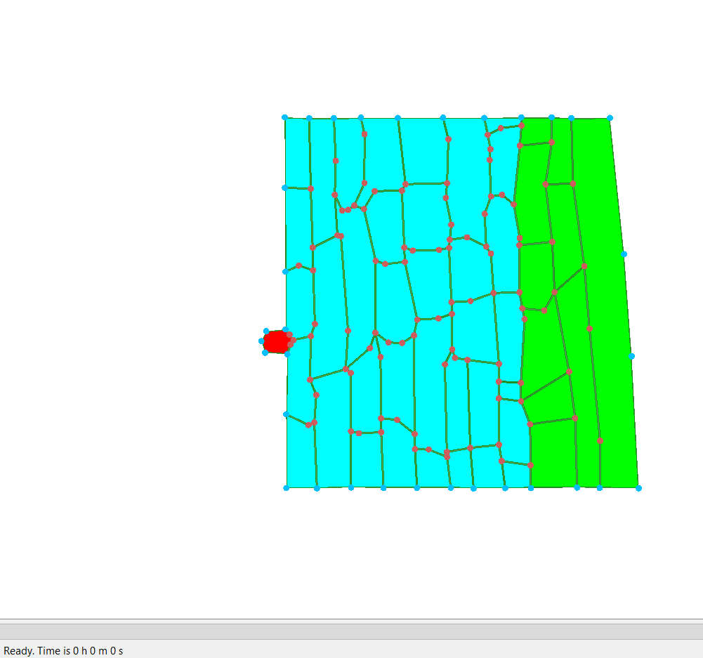

# KEN3170 – Plant Tissue Simulations

## Assignment

### 1. Pathogen infection over 2 hours

The infected region starts on the left side and slowly spreads further into the tissue. As the infection spreads, the cells close to it become more deformed and irregular because their walls get weaker.

**T = 0 min**

**T = 30 min**

**T = 60 min**

**T = 90 min**

**T = 120 min**

### 2. Cell wall stiffness

A cell's wall starts with stiffness 3. As its chemical level increases, the stiffness is reduced using `stiffness = 3 - chemical level`. The chemical effect is capped, so the stiffness can only decrease to about 1.8. The pathogen cells (`CellType 2`) are different. They do not weaken their own walls. Instead, they keep stiffness at 3, grow larger, and divide when they reach the division threshold.

### 3. Cell-to-cell transport and feedback

The diffusion coefficient is `0.00001 / stiffness`. So when there is more chemical, the wall gets less stiff, and when the stiffness is lower the chemical diffuses faster. This makes the chemical spread to more cells, which can weaken more walls. It is positive feedback because the chemical helps itself spread more.

### 4. Effect of `rel_cell_div_threshold`

When `rel_cell_div_threshold = 3`, the pathogen has to grow much bigger before it can divide, so the population expands more slowly. When `rel_cell_div_threshold = 1`, it reaches the division condition much sooner, so it divides faster and the pathogen population grows more quickly. In the pictures, by T = 120 the pathogens look almost the same size, but after 5 hours we can clearly see that threshold 1 has produced more pathogen cells.

**`rel_cell_div_threshold = 3`**

**`rel_cell_div_threshold = 1`**

**Comparison at T = 300 min**

### 5. Cell neighbours

TODO: Add answer.

### 6. Plant defense

The defense would go in `CellHouseKeeping`, inside the "cell wall weakening happens here" block, for plant cells only (`CellType != 2`). The stiffness is set again for every cell at every step, so the defense check has to come before the weakening rule. Otherwise the weakening would overwrite it.
