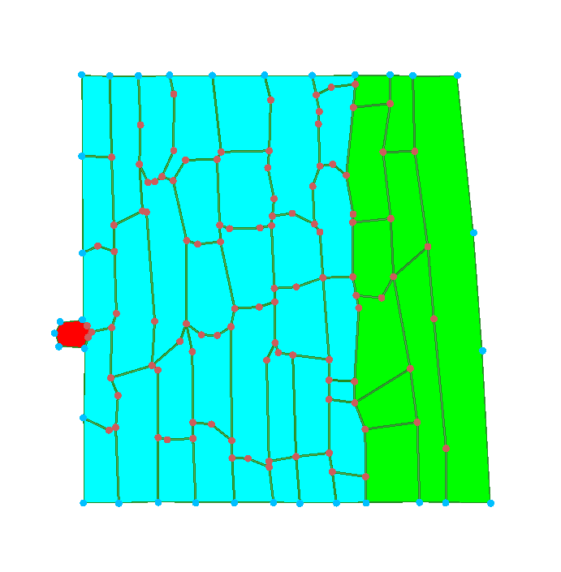
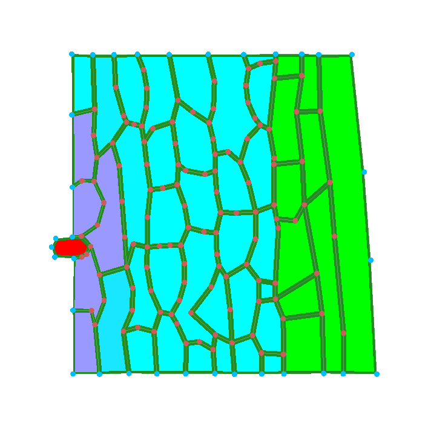
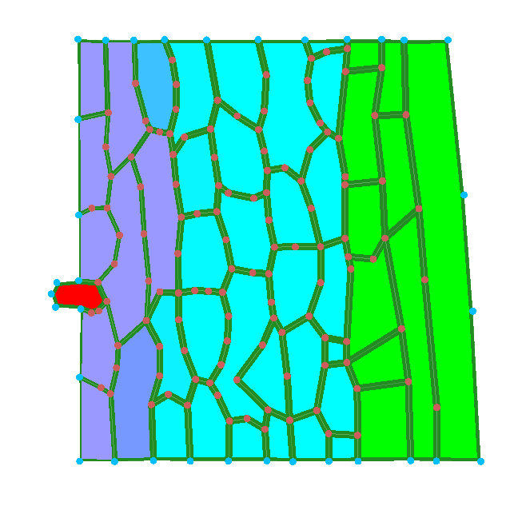
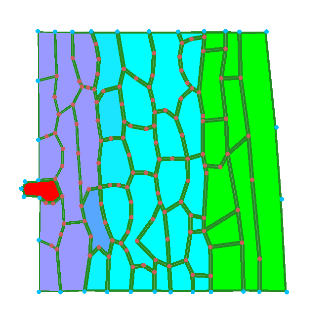
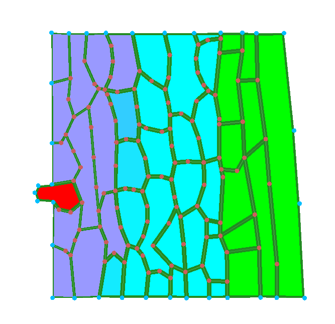
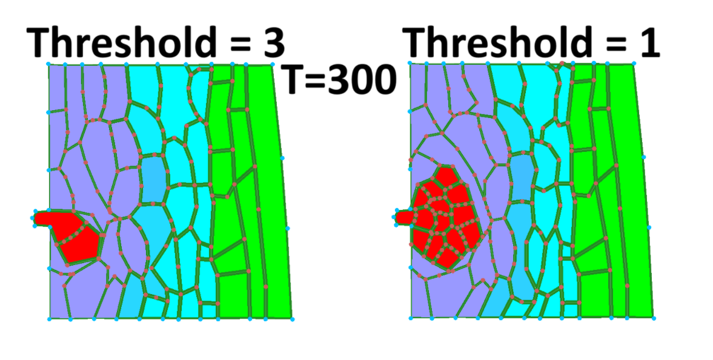
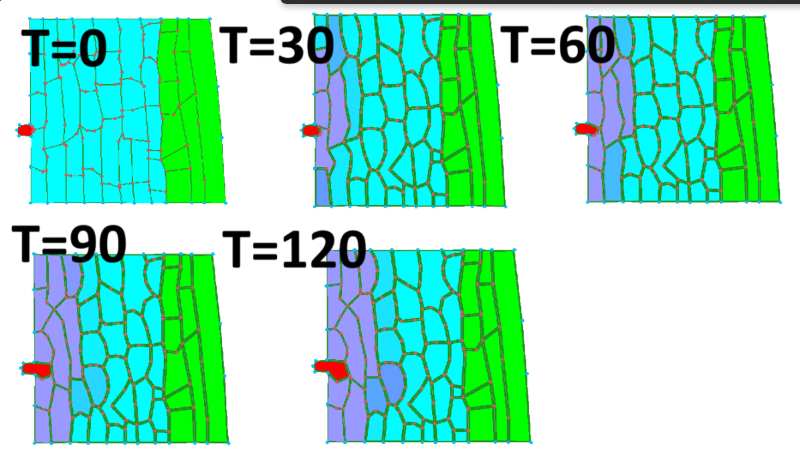
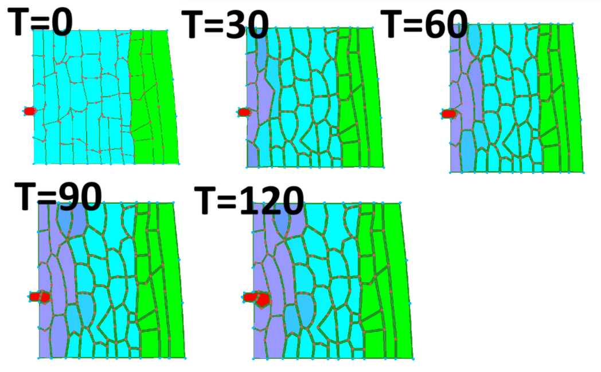
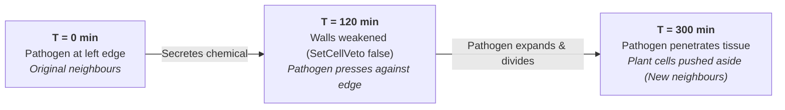
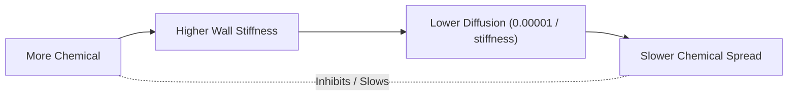

#### KEN3170 – Multi-Scale Modelling of Bio-Systems
# Assignment - 5 - Plant Tissue Simulations

### 1. Pathogen infection over 2 hours
#### Open pathogen_infection model and run for a duration of 2h. Screenshot initial and every 30 min. Describe how the infected region spreads and how the tissue deform

The pathogen (red) sits at the left edge of the tissue. It produces a chemical that diffuses into the neighbouring plant cells, which turn purple as the chemical reaches them (cyan = healthy plant cells, green = second plant cell type, purple = plant cells with pathogen chemical and weakened walls). The first column of cells is already purple at T = 30, the purple region reaches the second column by T = 60, and by T = 120 it covers about 2–3 columns. Meanwhile the pathogen grows slowly and starts pushing into the left edge. Between T = 0 and T = 30 the cells round off across the whole tissue, including far from the pathogen. This is the mechanics relaxing from the initial layout, not the infection itself.

| Color Sample | Hex Code | Cell Type / State | Description |
| :---: | :---: | :--- | :--- |
|  | `#00FFFF` | Healthy Plant Cell | Uninfected cell with base wall stiffness (`3.0`) and locked walls (`SetCellVeto(true)`). |
|  | `#8A2BE2` | Infected Plant Cell | Contains pathogen chemical; wall stiffness drops (`3.0 - chemical`) and walls unlock (`SetCellVeto(false)`). |
|  | `#FF0000` | Pathogen / Wall Nodes | Active pathogen cells and wall vertices; secretes chemical, expands, and divides. |
|  | `#008000` | Cell Wall Borders | Intercellular boundaries; stores per-side stiffness and controls diffusion transport. |


| T = 0 min | T = 30 min | T = 60 min | T = 90 min | T = 120 min |
| :---: | :---: | :---: | :---: | :---: |
|  |  |  |  |  |

---
### 2. Cell wall stiffness
#### In the model files `(Github repo – Models – Infection – infection.cpp9:Read CellHouseKeeping.)` In your own words: how is a cell's wall stiffness reduced as a function of its chemical level? What does the pathogen do differently?
A cell's wall starts with stiffness 3. The chemical level is first scaled as `patho_chem_level = Chemical(0) / 0.5` and capped at 1.2. If this level is above 0.1, the stiffness is reduced to `stiffness = 3 - patho_chem_level`, so it can only go down to 1.8. Weakened cells also lose their veto (`SetCellVeto(false)`), which allows their walls to be reorganised. The pathogen cells (`CellType 2`) are different. They do not weaken their own walls. Instead, they keep stiffness at 3, grow larger, and divide when they reach the division threshold.

---
### 3. Cell-to-cell transport and feedback
#### In the model files `(Github repo – Models – Infection – infection.cpp9: Read CelltoCellTransport)`. How is the diffusion coefficient defined? Explain the feedback loop this creates and sketch it: chemical lowers stiffness, lower stiffness raises diffusion, faster diffusion spreads the chemical. Is this positive or negative feedback?
The diffusion coefficient is `0.00001 / stiffness`. So when there is more chemical, the wall gets less stiff, and when the stiffness is lower the chemical diffuses faster. This makes the chemical spread to more cells, which can weaken more walls. It is positive feedback because the chemical helps itself spread more.


---
### 4. Effect of `rel_cell_div_threshold`
#### Raise and lower `rel_cell_div_threshold`. How does it change how fast the pathogen population expands? Document two runs.

When `rel_cell_div_threshold = 3`, the pathogen has to grow much bigger before it can divide, so the population expands more slowly. When `rel_cell_div_threshold = 1`, it reaches the division condition much sooner, so it divides faster and the pathogen population grows more quickly. The default value is 2. By T = 90, the pathogen with threshold 1 has already divided into two cells, while with threshold 3 it is still one cell that has grown larger. After 5 hours the difference is clear: threshold 1 has produced a round colony of many small pathogen cells, while threshold 3 has only a few large ones.

<p align="center">
  <br>
  <b>T = 300 min</b>: <code>rel_cell_div_threshold = 3</code> (left) vs <code>rel_cell_div_threshold = 1</code> (right)<br>
  <sub>Threshold 3 has a few large pathogen cells; threshold 1 has a round colony of many small ones.</sub>
</p>

<p align="center"><b>Time course (0–120 min)</b></p>

<table>
  <tr>
    <th width="50%"><code>rel_cell_div_threshold = 3</code></th>
    <th width="50%"><code>rel_cell_div_threshold = 1</code></th>
  </tr>
  <tr>
    <td></td>
    <td></td>
  </tr>
  <tr>
    <td align="center"><sub>Pathogen grows larger but is still one cell at T = 90</sub></td>
    <td align="center"><sub>Pathogen has already divided into two cells by T = 90</sub></td>
  </tr>
</table>

---

### 5. Cell neighbours
#### What is a fundamental difference regarding cell neighbours in this model compared to all other models that you have worked with so far?

In the other models we worked with (auxin transport and auxin growth), a cell's neighbours never change. The only way a cell gets a new neighbour is through division. This matches real plants, where cells are glued together by the middle lamella and cannot slide past each other.

In the infection model, neighbours can change during the simulation. In `CellHouseKeeping`, healthy cells get `SetCellVeto(true)`, but cells weakened by the pathogen chemical get `SetCellVeto(false)`. In `mesh.cpp`, wall elements can only be reconfigured for cells without a veto. This means wall segments can be moved from one cell to the neighbouring cell. Once the walls are weakened, the borders between cells are no longer fixed. The pathogen keeps growing (`EnlargeTargetArea(2)`) and dividing, so it can push into the weakened tissue and squeeze in between plant cells. That way it can get new neighbours it did not touch at the start, similar to how fungal hyphae grow into real plant tissue.

This is visible in our simulations:  
-  Within the first 2 hours ([T = 0](images/infection_t00.png), [T = 120](images/infection_t120.png)) the pathogen only presses against the left edge. 
- After 5 hours ([T = 300 comparison](images/threshold_comparison_t300.png), see [section 4](#4-effect-of-rel_cell_div_threshold)), the pathogen has grown into the tissue and the plant cells have been pushed aside and arranged around it.


 It now borders plant cells that were several cells away from it at the start, so its neighbours have changed. This would not be possible in the other models.



Another difference is that wall stiffness is stored per wall element and per cell side. A wall shared by two cells can have a different stiffness on each side, and `getLengthAndStiffness()` takes the average of both sides when calculating diffusion.

---
### 6. Plant defense
#### The plant evolves a defense: cells above a chemical threshold stiffen their walls. Describe in pseudocode where in `CellHouseKeeping` this would go and what sign of feedback it adds. Do not implement it. Pseudocode for the different sections is enough!

The defense would go in `CellHouseKeeping`, inside the "cell wall weakening happens here" block, for plant cells only (`CellType != 2`). The stiffness is set again for every cell at every step, so the defense check has to come before the weakening rule. Otherwise the weakening would overwrite it.

```cpp
// new parameters
defense_threshold   // chemical level that switches on the defense (between 0.1 and 1.2)
defense_stiffness   // wall stiffness of a defended cell (higher than 3)

CellHouseKeeping(c):
    if c is pathogen (type 2):
        grow and divide as before              // unchanged

    set base wall element length as before     // unchanged

    patho_chem_level = min(Chemical(0) / 0.5, 1.2)

    if c is not pathogen:
        if patho_chem_level > defense_threshold:
            // defense: the cell senses a lot of pathogen chemical
            for each wall element of c:
                stiffness = defense_stiffness
            SetCellVeto(true)                  // walls can no longer be reconfigured
        else if patho_chem_level > 0.1:
            // weakening (original rule)
            for each wall element of c:
                stiffness = 3 - patho_chem_level
            SetCellVeto(false)
        else:
            // healthy (original rule)
            for each wall element of c:
                stiffness = 3
            SetCellVeto(true)
```

This adds **negative feedback**.  
The original loop is positive: more chemical → lower stiffness → higher diffusion (`0.00001 / stiffness`) → more spread. 


The defense turns the middle step around: more chemical → higher stiffness → lower diffusion → slower spread into and through that cell. A rise in chemical now triggers a response that limits further rise.



The stiffer walls also have a mechanical effect:   
- They weigh more in the wall length part of the Hamiltonian, so they resist being stretched by the growing pathogen. 
- Setting the veto back to true also stops the pathogen from pushing in between cells, which is how it gained new neighbours in section 5. 
- We would expect the infection to slow down or stop, with a ring of stiff cells forming around it. 
- Because the defense only switches on above the threshold, cells at the front would still be weakened for a short time before they defend. 
- So the positive feedback dominates at low chemical levels and the negative feedback takes over at high levels.
